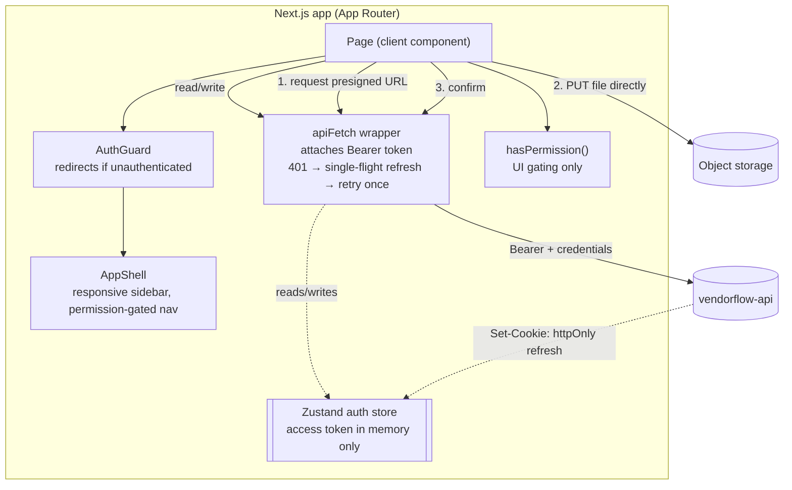

# VendorFlow Web

Frontend for **VendorFlow**, a multi-tenant B2B SaaS for vendor onboarding and compliance. It talks to [`vendorflow-api`](../vendorflow-api) over HTTP only; the API is the single source of truth.

**Stack:** Next.js 15 (App Router) · React 19 · TypeScript · Zustand · Tailwind v4

---

## What it does

- **Staff app** for admins, finance, and procurement: define document requirements, manage the team and custom roles, review the approval queue, and handle billing.
- **Vendor portal**, a scoped view where a vendor sees only their own checklist and uploads files directly to object storage.
- **Permission-aware UI**: navigation and actions are shown or hidden based on the user's permissions (cosmetic only; every action is enforced server-side).

---

## Architecture

Every page is a client component that composes its own chrome via `AuthGuard` (redirects unauthenticated users) and `AppShell` (responsive sidebar). State is intentionally lean: a single Zustand store for auth, and per-page `useState` for data. There is no React Query; the API client owns the auth-refresh logic explicitly.



**Auth model:** the long-lived refresh token lives in an httpOnly cookie the browser sends automatically (`credentials: 'include'`), unreadable by JavaScript. The short-lived access token lives only in memory (the Zustand store), never in `localStorage`, so an XSS bug cannot scrape it. On a `401`, `apiFetch` silently calls `/auth/refresh` and retries once; refresh is **single-flight**, so a burst of concurrent `401`s triggers exactly one refresh call.

**Upload flow:** the browser asks the API for a presigned URL, PUTs the file **directly** to object storage (the signature in the URL is the authorization; no bytes flow through the API), then calls confirm.

---

## Tech stack, explained

Every frontend dependency and the exact role it plays here.

| Technology | What it is | How it is wired in VendorFlow |
|---|---|---|
| **Next.js 15 (App Router)** | A React meta-framework: file-based routing, layouts, and a production build/deploy target. | Routes live in `src/app`. The root `layout.tsx` hosts the Toast and Auth providers plus `AppChrome`, which keeps the sidebar mounted across navigation so link clicks swap only the page body. |
| **React 19** | The UI library. | Every page is a client component using hooks (`useState`, `useEffect`, `useCallback`) for local state and data loading. |
| **Zustand** | A tiny hook-based global state store. | `stores/auth.ts` holds the current user and the access token. The token lives **in memory only** (never `localStorage`), so an XSS bug cannot scrape it; the httpOnly refresh cookie restores it on reload. |
| **Tailwind CSS v4** | A utility-first CSS framework with theme tokens defined in CSS. | Brand tokens (green `#16352B`, gold `#C2A24A`) declared once in `globals.css` via `@theme`, generating utilities like `bg-brand` and `text-gold`. No `tailwind.config.js`. |
| **react-hook-form + @hookform/resolvers + Zod** | Form-state management plus schema validation. | Used on the form-heavy pages (login, signup, accept-invite, verify-email, dialogs) via `zodResolver`. Schemas mirror the API's contracts so the client and server agree. |
| **Native fetch wrapper** | A hand-rolled typed API client (no React Query). | `lib/api/client.ts` attaches the Bearer token, sends `credentials: 'include'` for the refresh cookie, and on a `401` performs a **single-flight** refresh then retries once. Domain modules in `lib/api/*` wrap it per resource. |

The deliberate choice throughout is minimal state: one Zustand store for auth, per-page `useState` for data, and an explicit fetch wrapper rather than a data-fetching library, so the auth-refresh mechanics stay visible and owned.

---

## Project structure

```
src/
  app/
    layout.tsx        root: Toast + Auth providers (only server component)
    login, signup, accept-invite      public, AuthLayout chrome
    dashboard         metrics overview
    vendors, vendors/[id]             directory + per-vendor checklist
    documents         requirement templates
    approvals         review queue
    team              members + invitations
    settings          roles & permission toggles (RBAC management)
    billing           plans + subscription
    portal            vendor-scoped upload view
  components/         AuthGuard, AppShell, Toast, ConfirmDialog, dialogs, Ui primitives
  stores/auth.ts      Zustand: user, access token, status
  lib/
    api/              typed fetch wrappers per domain (vendors, documents, ...)
    api/client.ts     apiFetch + ApiError + single-flight refresh
    permissions.ts    hasPermission (UI gating), the 11-permission vocabulary
    types.ts          DTOs mirroring the api's contracts/
  app/globals.css     Tailwind v4 theme tokens (brand green #16352B / gold #C2A24A)
```

---

## Getting started

Requires Node 20+ and a running [`vendorflow-api`](../vendorflow-api).

```bash
# 1. Install
npm install

# 2. Configure (defaults to http://localhost:4000)
cp .env.example .env.local     # NEXT_PUBLIC_API_URL=http://localhost:4000

# 3. Run (the API must be running too)
npm run dev                    # http://localhost:3000
```

---

## What was hard and how I solved it

**A refresh flow that does not stampede.** When an access token expires, several in-flight requests can fail with `401` at the same moment. A naive design fires one refresh per failed request, racing to rotate the same token. I made refresh **single-flight** with a module-level promise: the first `401` starts the refresh, every other concurrent `401` awaits the same promise, and all then retry once. One rotation, no race, no retry loop (the retry runs with refresh disabled).

**Keeping the valuable secret out of JavaScript's reach.** Putting a token in `localStorage` is convenient but exposes it to any XSS. I split the two tokens by risk: the long-lived refresh token stays in an httpOnly cookie the browser manages, and the access token lives only in a memory store, accepted as lost on a hard refresh because the cookie silently restores the session on load.

**Making the UI reflect permissions without pretending to enforce them.** The sidebar and every action button are gated by a `hasPermission` check so users are not shown controls they cannot use. This is purely cosmetic; the server independently enforces each action. Treating client gating as UX rather than security kept the boundary honest: un-hiding a button in dev tools still gets a `403`.

**Optimistic role editing that reverts cleanly.** On the roles screen, toggling a permission updates local state immediately, then calls the API; on failure it reloads to snap back to server truth. It feels instant without ever showing a state the server did not accept.

---

## Tests

The web app currently relies on two layers of safety rather than its own runtime test suite:

- **TypeScript across the boundary.** `src/lib/types.ts` and `src/lib/permissions.ts` mirror the API's contracts, so a shape mismatch surfaces at compile time. `npm run build` is the gate.
- **The API's integration tests.** The backend's Supertest suite exercises the real request flows this UI depends on (auth, isolation, billing limits), so the contracts the frontend consumes are verified end to end on the API side.

**Planned web test strategy (next step, not yet implemented):**

| Layer | Tool | Target |
|---|---|---|
| Unit | Vitest | `hasPermission` gating logic; the `apiFetch` 401 → single-flight refresh → retry path |
| Component | Vitest + React Testing Library | Permission-gated rendering (buttons shown/hidden), ConfirmDialog, form validation states |
| End-to-end | Playwright | signup → add vendor → invite → vendor uploads → staff approves, against a seeded test API |

The refresh single-flight logic and the `hasPermission` helper are the highest-value first targets because they are pure and carry the most risk.

---

## License

Private project built as a deep-dive learning exercise.
